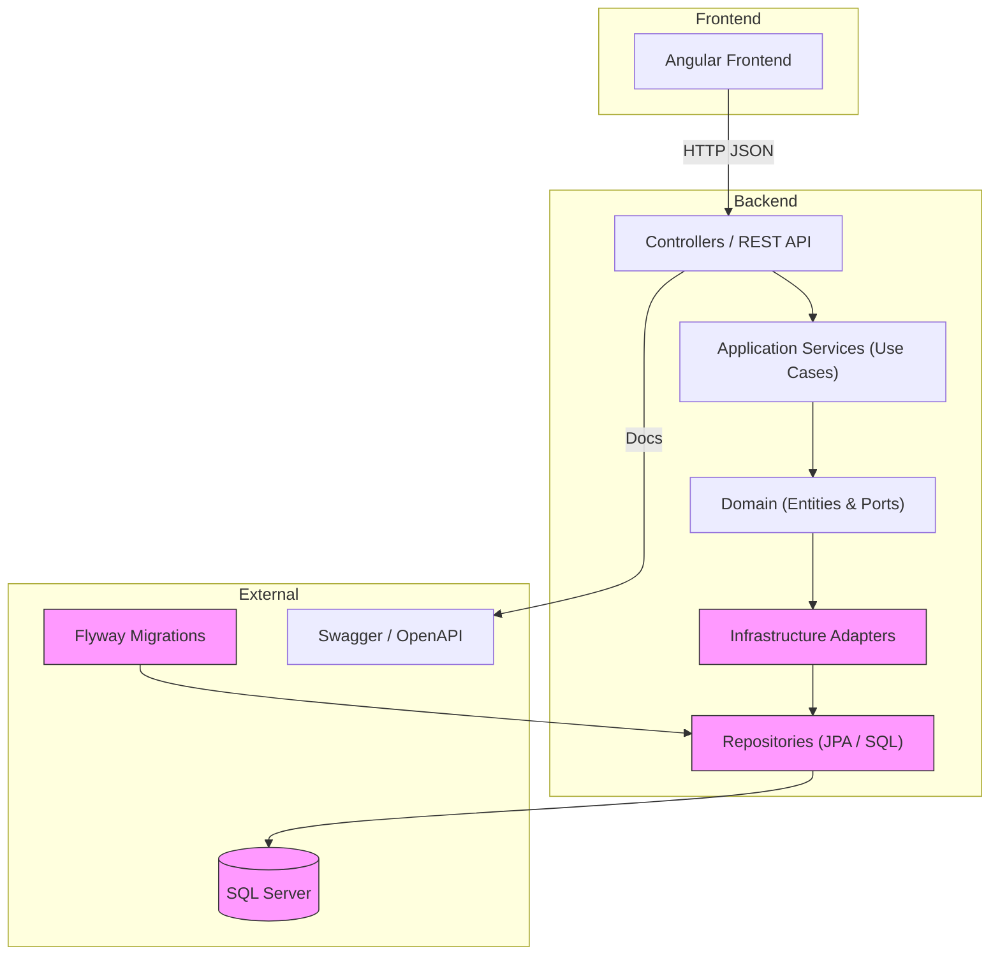
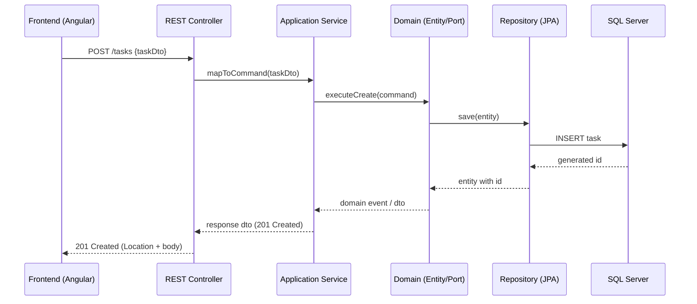

```
(\ (\
( • •)  
━∪∪━━━━ 
ᵇʸ ᴬˡᵉᶠᵘᵉⁿᵗᵉˢ
```
# Stefanini Task Manager - Fullstack Challenge
     𖥔   


<br />

> Solución integral para la gestión de tareas desarrollada para el proceso técnico de Stefanini (Brasilia). Este proyecto demuestra la implementación de arquitecturas modernas, principios de Clean Code y una esteira de CI/CD automatizada.

## 🏛️ Arquitectura del Sistema
### Backend (Java 21 + Spring Boot 3.5)
Se ha implementado una **Arquitectura Hexagonal (Ports & Adapters)** combinada con **DDD (Domain-Driven Design)** para garantizar el desacoplamiento total de la lógica de negocio.
- **Domain Layer:** Entidades puras y contratos de interfaces (Ports).
- **Application Layer:** Servicios de orquestación y casos de uso.
- **Infrastructure Layer:** Adaptadores para SQL Server (JPA), Clientes API (WebClient) y Documentación (OpenAPI).

### Frontend (Angular 20)
Interfaz vanguardista utilizando el motor **Zoneless** y **Signals** para una reactividad de alto rendimiento.
- **Standalone Components:** Eliminación de NgModules para un bundle más ligero.
- **Tailwind CSS:** Diseño responsivo con estética de producto comercial (SaaS).
- **Vite Proxy:** Configuración de comunicación transparente con el backend.

---

## Tecnologías Utilizadas

- **Lenguajes:** Java 21, TypeScript.
- **Frameworks:** Spring Boot 3.5, Angular 20.
- **Persistencia:** MS SQL Server 2022 + Flyway (Migrations).
- **DevOps:** GitHub Actions, Docker, Docker Compose.
- **Calidad:** JUnit 5, Mockito, MockMvc, AssertJ.

---

## Guía de Inicio Rápido

> ☕︎ ˖ Verifique que las dependencias están instaladas en su entorno de trabajo/teste.

1.  **Clone o repositório:**
    ```bash
    git clone https://github.com/ale-fuentes-ar/stefanini-task-manager.git
    ```

    ```bash
    cd stefanini-task-manager
    ```

2. Requisitos Previos
    - Docker & Docker Desktop.
    - JDK 21.
    - Node.js 20+.

3. Infraestructura (Docker)
    Levanta la base de datos SQL Server y servicios secundarios:
    ```bash
    docker-compose up -d

    # verificar si en database 'stefaninidg' exist
    # 1- si Exited (0) => ejecuto script sin problemas
    docker ps -a --filter "name=task-sql-init"

    # 2- visualizar logs, si no retorna, no hubo logs de errores
    docker logs task-sql-init

    # 3- Listar los bancos de datos disponibles, como utilice gitbash, uso al inicio dos barras '//opt...'
    docker exec -it task-sql-server //opt/mssql-tools18/bin/sqlcmd -S localhost -U sa -P 'Stefanini2025!' -C -Q "SELECT name FROM sys.databases"
    ```

4. Ejecución Backend
    ```bash
    cd backend
    ./mvnw spring-boot:run
    ```
    *API disponible en: `http://localhost:8081` | Swagger: `/swagger-ui/index.html`*

5. Ejecución Frontend
    ```bash
    cd frontend
    npm install
    npm start
    ```
    *App disponible en: `http://localhost:4200`*

---

## Uso de Inteligencia Artificial (IA)
En cumplimiento con los requisitos de Stefanini, se documenta el uso de IA durante el desarrollo:
- **Herramienta:** ChatGPT/Claude (Modelo GPT-4o).
- **Uso:** Asistencia en la definición de la estructura hexagonal, generación de boilerplate para migraciones SQL y configuración del pipeline de GitHub Actions para SQL Server.
- **Validación:** Cada fragmento de código fue revisado, refactorizado para cumplir con **SOLID** y testeado manualmente para asegurar la integridad del sistema.

---

## Metodología de Trabajo
Se utilizó **GitFlow** estrictamente para la gestión de ramas:
- `main`: Versión estable de producción.
- `develop`: Integración continua.
- `feature/*`: Desarrollo de funcionalidades aisladas (CRUD, UI, CI/CD).

---

## Diagramas

- **Arquitectura (Hexagonal / Ports & Adapters):** Diagrama de alto nivel que muestra las capas y adaptadores principales del proyecto.



- **Flujo de datos (ej. crear una tarea):** Secuencia desde la UI hasta la persistencia y respuesta.




